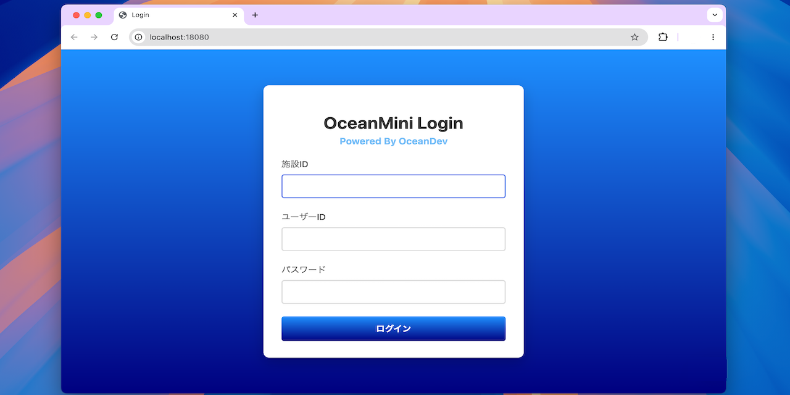

# OceanMini OpenSource Version

[OceanMini](https://phazor.info/OpenOcean/?page_id=592) のオープンソース版のソースコードの一部です。

今回は組み込み Web サーバに [Crow](https://github.com/CrowCpp/Crow) を使ってみました。

## 動作環境

- CMake 3.15 以上
- C++17 対応コンパイラ
- MacOS / Windows / Linux

開発環境は MacOS ですが、OS 依存コードは使ってないので Win/Linux でも動くと思います。

## ビルド方法
ビルドには CMake が必要です。あらかじめインストールしておいてください。
```bash
mkdir build
cmake -S . -B build
cmake --build build
```
ビルドに成功すると、`build` フォルダ内に `oceanmini` が作成されます。

## 起動方法

```bash
./build/oceanmini
```
などで起動。デフォルトブラウザで http://localhost:18080 が開きます。  
`index.html` が表示されれば成功です。



## ライセンス

とりあえず GPL version 3。

## Third Party

This project uses Crow, licensed under the BSD 3-Clause License.

See `LICENSE_third_party`.
